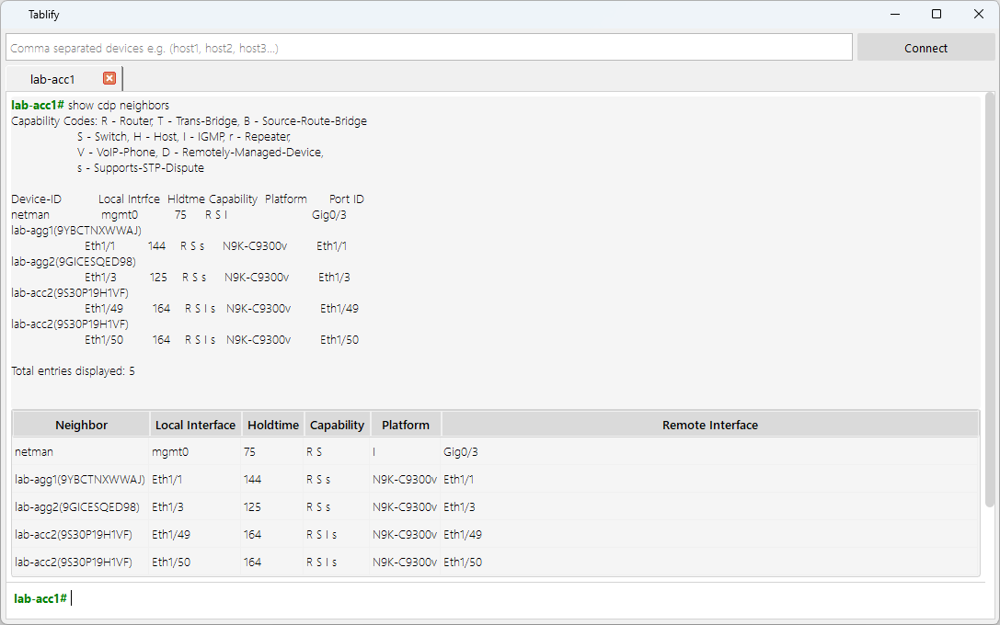

# Tablify

## Overview  
**Tablify** is a lightweight terminal-like tool designed to run show commands on network devices and display the output in both raw and parsed formats. Parsed output is generated using **TextFSM** with **ntc-templates**, and shown in a tabular format, making it easy to copy directly into Excel for reporting.

## Features  
- **Command Execution**: Run show commands across one or multiple devices  
- **Dual Output View**: View both raw terminal output and parsed table output  
- **TextFSM Parsing**: Automatically parses known commands using ntc-templates  
- **Excel-Friendly**: Copy entire tables (with headers) into Excel for quick reporting  
- **Tabbed Interface**: Get a dedicated tab for each connected device  

## Migration Lifecycle  
- Pre-Migration Checks  
- Post-Migration Validation  
- General Diagnostics & Reporting  

## Usage  
1. **Add Devices**: Enter the list of devices to connect to  
2. **Click Connect**: A tab will be created for each connected device  
3. **Run Commands**: Enter any show command and view raw/parsed output  
4. **Export to Excel**: Copy parsed tables with a single click for reporting  

## Tags  
`#Tablify` `#Netmig` `#NetworkAutomation` `#TextFSM` `#NTCTemplates` `#NetworkScripting` `#CommandParser` `#ExcelExport` `#Cisco` `#TerminalTool`

## Screenshots

